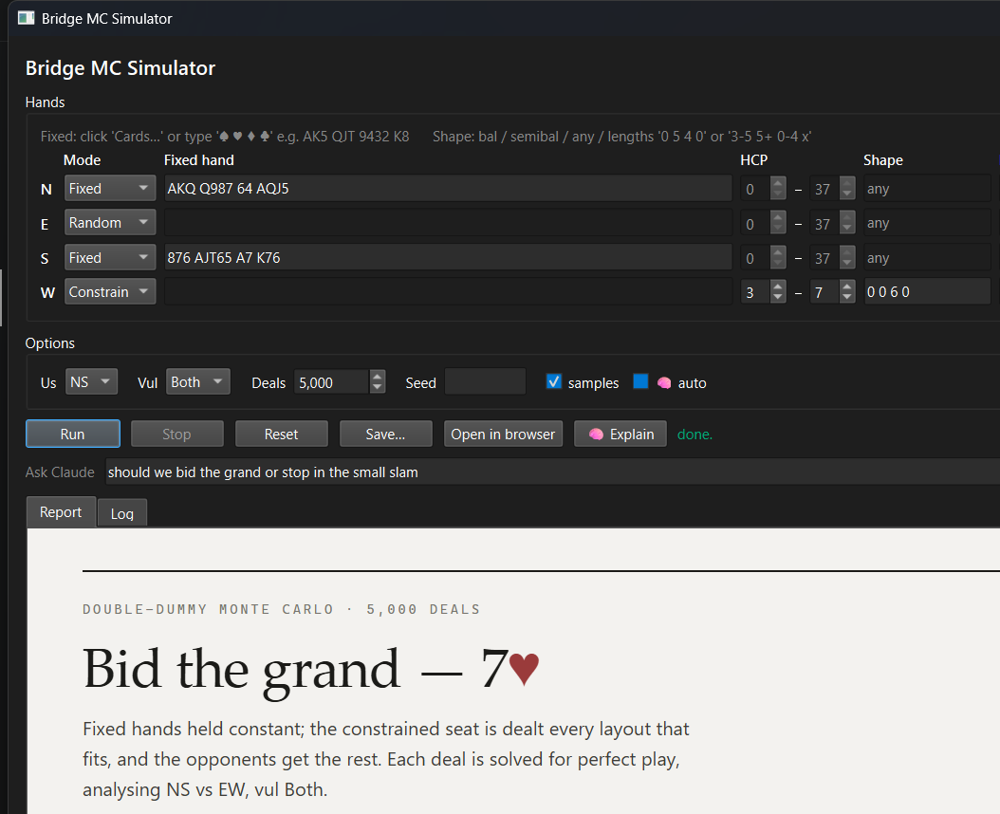

# Bridge MC Simulator

A small Monte-Carlo tool for **bridge bidding analysis**. You fix your own hand,
constrain partner by HCP and shape, and it generates thousands of deals and
solves each one **double-dummy** to report how often games and slams make.

It ships with a Tk GUI and a couple of headless example scripts.



## What it answers

For a fixed hand opposite a constrained partner, e.g. *"partner is 22–24
balanced"*, it reports make-rates for **every game and slam** with 95%
confidence intervals, plus a few sample layouts:

```
5000 deals  (5000 tries, 100.0% accepted)
double-dummy, best NS declarer

GAMES
--------------------------------
  3NT         95.4% +-0.6  ###################
  4H          76.x% +-...  ###############
  4S          ...
  5C          ...
  5D          90.8% +-0.8  ##################
  any game    99.x% +-...

SLAMS
--------------------------------
  6C          58.0% +-1.4  ############
  6D          49.4% +-1.4  ##########
  6H          ...
  6NT         ...
  any slam    69.9% +-1.3  ##############
  grand(7)    15.0% +-1.0  ###

SAMPLE PARTNER HANDS
--------------------------------
  ♠AK8 ♥AQ7 ♦AJ6 ♣A872  HCP 22  shape (3,3,3,4)  tricks C11 D11 H10 S10 NT11
  ...
```

so you can decide whether a slam try is worth it and which strain is the spot.

**Features**

- **Per-seat input:** every seat (N/E/S/W) can be Random, a Fixed hand, or
  Constrained (HCP + shape / min-lengths).
- Every strain (♣/♦/♥/♠/NT) at game and slam level, plus grand-slam rate.
- **Choose the side** to analyse (NS or EW) and the **vulnerability**.
- **Scoring:** average score per contract, and a bidding-decision readout —
  best game vs best slam by expected value, and the **expected IMP gain per
  board** of bidding the slam.
- Modern Windows-11 theme (`sv-ttk`) with a light/dark toggle; falls back to a
  clean built-in theme if `sv-ttk` isn't installed.
- **AI verdict** — an optional **🧠 Explain** button streams a plain-English
  bridge verdict from Claude (bid slam or stop, the safety net, key drivers).
  Enabled only when `ANTHROPIC_API_KEY` is set; the simulator itself needs no
  network or key. Easiest way to enable it: paste your key into `apikey.txt`
  (git-ignored) and double-click **`run_with_ai.bat`** (Windows).
- Input validation, optional RNG **seed**, sample deals, and a **Stop** button
  (rare constraints can't hang the app).
- Fast: batched `CalcAllTables` across all cores solves ~32 full deals per DDS
  call (~10 ms/deal), so 5,000 deals finish in about a minute.

## How it works

- **Deal generation:** [Redeal](https://github.com/anntzer/redeal) — with
  **smartstack** importance sampling, so rare partner types (like 22–24
  balanced) are generated directly instead of by slow rejection.
- **Evaluation:** Bo Haglund & Søren Hein's **DDS** double-dummy solver
  (bundled with Redeal), the same engine behind most serious bridge software.

## Install

Requires **Python 3.8+**.

Redeal is easiest to install straight from its repo (its DDS binaries ride
along):

```sh
# macOS / Linux (needs git + libgomp)
python -m pip install "git+https://github.com/anntzer/redeal"

# Windows: download the main-branch ZIP from the Redeal repo and
python -m pip install redeal-main.zip
```

The example scripts under `examples/` instead use
[endplay](https://pypi.org/project/endplay/) (a pip-installable all-in-one that
also bundles DDS):

```sh
python -m pip install endplay
```

## Standalone app (no Python needed)

Prefer a double-click app? Grab the packaged build from the
[Releases](https://github.com/prismark13/bridge-MC-simulator/releases) page
(`BridgeMCSimulator.exe` on Windows) — it bundles Python, Tk, Redeal and the DDS
solver into one file, so end users install nothing.

Build it yourself:

```powershell
# Windows
powershell -ExecutionPolicy Bypass -File build.ps1        # -> dist\BridgeMCSimulator.exe
```
```sh
# macOS / Linux
python -m pip install pyinstaller "git+https://github.com/anntzer/redeal"
pyinstaller --noconfirm --onefile --windowed --name BridgeMCSimulator \
    --collect-all redeal bridge_sim_gui.py                 # -> dist/BridgeMCSimulator
```

The `--collect-all redeal` flag is essential: it pulls Redeal's bundled DDS
library into the frozen app. A GitHub Actions workflow
(`.github/workflows/build.yml`) builds all three platforms automatically when a
`v*` tag is pushed.

## Usage

**GUI:**

```sh
python bridge_sim_gui.py
```

Each seat (N/E/S/W) has a **Mode**:

- **Random** — dealt at random.
- **Fixed** — type the exact 13 cards as `♠ ♥ ♦ ♣`, e.g. `AK5 QJT 9432 K8`
  (`-` for a void).
- **Constrain** — set an **HCP** range and a **Shape**:
  - `bal` / `semibal` → balanced/semibalanced (fast — uses smartstack).
  - `any` → shape unconstrained (HCP only).
  - four min-lengths `♠ ♥ ♦ ♣`, e.g. `0 5 4 0` = 5+♥ and 4+♦ (rejection sampling).

Smartstack accelerates one balanced/semibalanced constrained seat; any other
constrained seat is handled by rejection (with a try-cap so impossible
constraints can't hang). Pick a deal count and hit **Run**. Results show every
NS game and slam with 95% CIs, plus sample deals.

**Headless examples:**

```sh
python examples/sim_partner_5h4d.py     # 6D vs 3NT, partner 5+H/4+D 16-21
python examples/sim_slam_finesse.py     # minor-suit slam + finesse-dependence test
```

## A word on double-dummy numbers

Double-dummy solving assumes **perfect play by everyone with all 52 cards
visible** — so it always guesses two-way finesses right and finds every squeeze.
Real single-dummy results run roughly ½–1 trick worse. `sim_slam_finesse.py`
includes an East/West-swap test that estimates how much of a contract's success
depends on card *position* (a finesse/guess) versus power and breaks.

## License

GPL-3.0 — because this depends on Redeal, which is GPL-3.0. The bundled DDS
solver has its own permissive license (see the Redeal / DDS projects).
